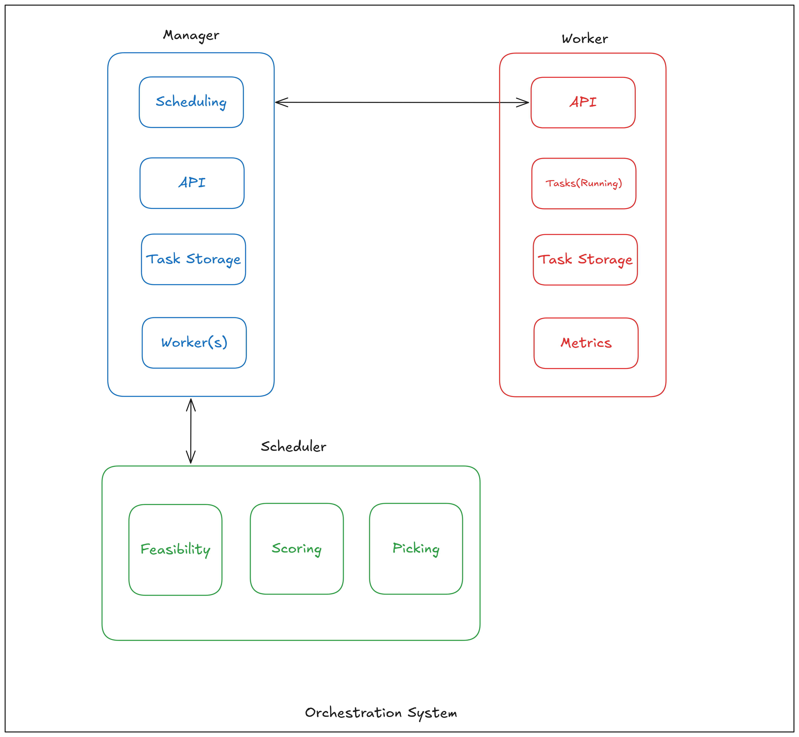

# Cube
Orchestrator from scratch.
- Users interact with the system via manager's API.
- The manager persists all tasks in the system datastore.
- The manager maintains a list of workers in the system and metrics about each worker.
- The manager uses a scheduler to calculate where it should place the task.
- The manager sends tasks to the worker and pull metrics from it via the worker's API. 
- The worker persists it's own tasks in a datastore
- The worker makes metrics about its tasks and other relevant system metrics available to the manager.

> [!WARNING]  
> A self maded orchestrator for educational purposes which is not ready for production.

## Architecture


## Tech Stack
- Go 1.23.2
- [bbolt](https://github.com/etcd-io/bbolt) as an embedded Key/value datastore.

## Scheduler
The implementation provides two types of scheduling :
- Roundrobin
- EPVM (Extended Parallel VM) adapated for this small ochestrator.

## How To
```shell
A Cli to interact with cube orchestrator.

Cube is an orchestrator based on containers.

Usage:
  cube [command]

Available Commands:
  completion  Generate the autocompletion script for the specified shell
  help        Help about any command
  manager     Manager command to operate a Cube manager node.
  node        Node command to list nodes.
  run         Run a new task.
  status      Status command to list tasks.
  stop        Stop a running task.
  worker      Worker command to operate a Cube worker node.

Flags:
  -h, --help   help for cube
```

## Manager
Run a manager instance and passing a list of workers.
```shell
cube manager --workers 'worker-1:5556,worker-2:5557'
```

## Worker
Run an instance of a worker
```shell
cube worker --name worker-2 --port 5557
```

## Run Tasks
Run a task using a json file
```json
{
  "ID": "a7aa1d44-08f6-443e-9378-f5884311019e",
  "State": 2,
  "Task": {
    "State": 1,
    "ID": "bb1d59ef-9fc1-4e4b-a44d-db571eeed203",
    "Name": "test-chapter-9.1",
    "Image": "timboring/echo-server:latest",
    "ExposedPorts": {
      "7777/tcp": {}
    },
    "PortBindings": {
      "7777/tcp": "7777"
    },
    "HealthCheck": "/health"
  }
}
```
```shell
cube run -f task.json --manager manager:5555
```

### List workers
```shell
cube node
```
```shell
NAME               MEMORY (MiB)     DISK (GiB)     ROLE       TASKS     
worker-1:5556      15684            467            worker     4         
worker-2:5557      15684            467            worker     2
```
### List running tasks
```shell
cube status
```
```shell
ID                 NAME                 CREATED                    STATE         CONTAINERNAME        IMAGE                            
bb1d59ef           test-chapter-9.1     Less than a second ago     Scheduled     test-chapter-9.1     timboring/echo-server:latest
```
```shell
ID                 NAME                 CREATED                    STATE         CONTAINERNAME        IMAGE                            
bb1d59ef           test-chapter-9.1     2 minutes ago              Running       test-chapter-9.1     timboring/echo-server:latest
```